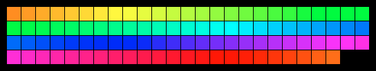

# Neopixel-web



## How2Run
Install the dependencies with [npm](https://www.npmjs.com/):
```
npm i
```

To develop on a live-reloading page, run [Browsersync](https://browsersync.io/) using the repo's config.
This will host the page on `http:localhost:4200`:
```
npm start
```

Alternatively run Browsersync on its own, with your own arguments, via
```
npx browser-sync [args]
```

There's an included [VS Code](https://code.visualstudio.com/) snippet to make generating an effect function quicker. It tab completes with `effect`.
